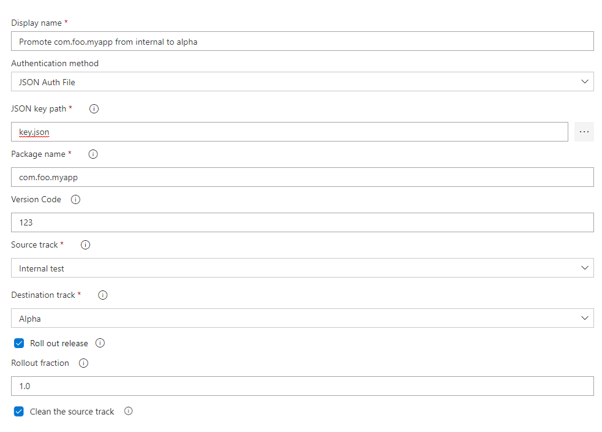

<table style="width: 100%; border-style: none;"><tr>
<td width="140px" style="text-align: center;"></td>
<td><strong>Visual Studio Team Services Extension for Google Play</strong><br />
<i>Provides build/release tasks that enable performing continuous delivery to the Google Play store from an automated VSTS build or release definition</i><br />
<a href="https://marketplace.visualstudio.com/items/ms-vsclient.google-play">Install now!</a>
</td>
</tr></table>

# Visual Studio Team Services Extension for Google Play

[](https://dev.azure.com/mseng/AzureDevOps/_build/latest?definitionId=5350)

This extension contains a set of deployment tasks which allow you to automate the release, promotion and rollout of app updates to the Google Play store from your CI environment. This can reduce the effort needed to keep your internal test, alpha, beta, rollout and production deployments up-to-date, since you can simply push changes to the configured source control branches, and let your automated build take care of the rest.

## Prerequisites

This extension supports Visual Studio Team Services (VSTS) and Team Foundation Server (TFS) 2017 and later.

In order to automate the release of app updates to the Google Play store, you need to have manually released at least one version through the [Google Play Developer Console](https://play.google.com/apps/publish/). Additionally, you need to create a service account that is authorized to manage your app(s) releases on your behalf and can be used to authenticate "headlessly" from your VSTS build/release definitions. If you haven't already done so, then perform the following steps to create a service account:

1. Login to the [Google Play Developer Console](https://play.google.com/apps/publish/) and select **Settings** in the left-hand navigation menu (the gear icon)

2. Select the **API access** setting and click the **Create Service Account** button underneath the **Service Accounts** section

3. Follow the provided **Google Developers Console** hyperlink

4. Click the **Create credentials** button in the displayed modal dialog, and select **Service account key**

5. Select **JSON** as the **Key type** and click the **Create** button

6. Save the provided JSON file somewhere safe and memorable. You'll be using it later.

7. Go to the **IAM** page and click on the **Add** button.

8. Select the newly created service account in the **New members** box and assign it the  **Service Account User Role**, then click **Save**.

9. Back in the **Google Play Developer Console**, click the **Done** button to close the modal

10. Click the **Grant access** button in the row associated with the service account you just created.
 
11. Ensure that the **Role** is set to **Release Manager** and then click the **Add user** button

To take advantage of the metadata updating capabilities, files need to be organized using fastlane’s [supply tool](https://github.com/fastlane/fastlane/tree/master/supply#readme) format:

1. Install the supply tool
```
sudo gem install supply
```
2. Navigate to your root folder 
```
cd [your_project_folder]
```
3. Download metadata for an existing app to the  project folder
```
supply init
```

## Quick Start

Once you have created or retrieved credentials for you Google Play service account, then perform the following steps to automate releasing updates from a VSTS build or release definition:

1. Install the Google Play extension from the [VSTS Marketplace](https://marketplace.visualstudio.com/items/ms-vsclient.google-play)

2. Go to your Visual Studio Team Services or TFS project, click on the **Build** tab, and create a new build definition (the "+" icon) that is hooked up to your project's appropriate source repo

3. Click **Add build step...** and select the neccessary tasks to generate your release assets (e.g. **Gulp**, **Cordova Build**)

4. Click **Add build step...** and select **Google Play - Release** from the **Deploy** category

5. Configure the **Google Play - Release** task with the JSON private key file created above, the generated APK file, and the desired release track.

6. Click the **Queue Build** button or push a change to your configured repo in order to run the newly defined build pipeline

7. Your app changes will now be automatically published to the Google Play store!

## Configuring Your Google Play Publisher Credentials

In addition to specifying your publisher credentials file directly within each build task, you can also configure your credentials globally and refer to them within each build or release definition as needed. To do this, perform the following steps:

1. Setup a publishing manager (https://play.google.com/apps/publish/) and get the JSON key file from the [Google Developer API console](https://console.developers.google.com/apis)

2. Go into your Visual Studio Team Services or TFS project and click on the gear icon in the upper right corner

3. Click on the **Services** tab

4. Click on **New Service Endpoint** and select **Google Play**

5. Give the new endpoint a name and enter the credentials for the publishing manager you generated in step#1. The credentials you need can be found in the JSON file and are the Email and the private key.

6. Select this endpoint via the name you chose in #5 whenever you add either the **Google Play - Release** or **Google Play - Promote** tasks to a build or release definition

## Task Reference

In addition to the custom service endpoint, this extension also contributes the following three build and release tasks:

* [Google Play - Release](#google-play---release) - Allows automating the release of a new Android app version to the Google Play store.

* [Google Play - Promote](#google-play---promote) - Allows automating the promotion of a previously released Android app update from one track to another (e.g. `alpha` -> `beta`).

* [Google Play - Increase Rollout](#google-play---increase-rollout) - Allows automating increasing the rollout percentage of a previous release app update.

### Google Play - Release

Allows you to release an update to your app on Google Play, and includes the following options:

1. **JSON Key Path** *(File path)* or **Service Endpoint** - The credentials used to authenticate with Google Play. This can be acquired from the [Google Developer API console](https://console.developers.google.com/apis) and provided either directly to the task (via the `JSON Auth File` authentication method), 

    

    or configured within a service endpoint that you reference from the task (via the `Service Endpoint` authentication method). 

    

    Note that in order to use the JSON Auth File method, the JSON file you get from the developer console needs to be checked into your source repo.


2. **APK Path** *(File path, Required)* - Path to the APK file you want to publish to the specified track.

    

3. **Track** *(String, Required)* - Release track to publish the APK to.

    

4. **Rollout Fraction** *(String, Required if visible)* - The percentage of users to roll the specified APK out to, specified as a number between 0 and 1 (e.g. `0.5` == `50%` of users). This option is only available when the **Track** input is set to **Rollout**.

    

5. **Release Notes** *(File path)* - Path to the file specifying the release notes for the APK you are publishing.

    

6. **Language Code** *(String, Optional)* - An IETF language tag identifying the language of the release notes as specified in the BCP-47 document. Default value is _en-US_.

7. **Update Metadata** *(Boolean, Optional)* - Allows automating metadata updates to the Google Play store by leveraging the contents of the `Metadata Root Directory`.

    

8. **Metadata Root Directory** *(String, Required if visible)* - Root directory for metadata related files. Becomes available after enabling the `Update Metadata` option. Expects a format similar to fastlane’s [supply tool](https://github.com/fastlane/fastlane/tree/master/supply#readme) which is summarized below:
 
```
$(Specified Directory)
   └ $(languageCodes)
     ├ full_description.txt
     ├ short_description.txt
     ├ title.txt
     ├ video.txt
     ├ images
     |  ├ featureGraphic.png    || featureGraphic.jpg   || featureGraphic.jpeg
     |  ├ icon.png              || icon.jpg             || icon.jpeg
     |  ├ promoGraphic.png      || promoGraphic.jpg     || promoGraphic.jpeg
     |  ├ tvBanner.png          || tvBanner.jpg         || tvBanner.jpeg
     |  ├ phoneScreenshots
     |  |  └ *.png || *.jpg || *.jpeg
     |  ├ sevenInchScreenshots
     |  |  └ *.png || *.jpg || *.jpeg
     |  ├ tenInchScreenshots
     |  |  └ *.png || *.jpg || *.jpeg
     |  ├ tvScreenshots
     |  |  └ *.png || *.jpg || *.jpeg
     |  └ wearScreenshots
     |     └ *.png || *.jpg || *.jpeg
     └ changelogs
       └ $(versioncodes).txt
```

9. **Update APK(s)** *(Boolean, Optional)* - By default, the task will update the specified binary APK file(s) on your app release. By unselecting this option you can update metadata keeping the APKs untouched. Default value is _true_.

    

#### Advanced Options

1. **Additional APK Path(s)** *(Text box)* - Paths to additional APK files you want to publish to the specified track (e.g. an x86 build) separated by new lines. This option allows the usage of wildcards and/or minimatch patterns. For example, **/*.apk to match the first APK file, in any directory.

    

2. **Upload deobfuscation file (mapping.txt)** *(File path, Optional)* - You may specify a path to the mapping.txt file that will be uploaded along with the main APK file.

3. **Replace version codes** *(String, Required)* - You may specify which APK version codes should be replaced in the track with this deployment. Available options are: *All*, *List* - comma separated list of version codes, *Regular expression* - a regular expression pattern to select a list of APK version codes to be removed from the track with this deployment, e.g. _.\\*12?(3|4)?5_ 

### Google Play - Promote

Allows you to promote a previously released APK from one track to another (e.g. `alpha` -> `beta`), and includes the following options:



1. **JSON Key Path** *(File path)* or **Service Endpoint** - The credentials used to authenticate with Google Play. This can be acquired from the [Google Developer API console](https://console.developers.google.com/apis) and provided either directly to the task (via the `JSON Auth File` authentication method), or configured within a service endpoint that you reference from the task (via the `Service Endpoint` authentication method). Note that in order to use the JSON Auth File method, the JSON file you get from the developer console needs to be checked into your source repo.

2. **Package Name** *(String, Required)* - The unique package identifier (e.g. `com.foo.myapp`) that you wish to promote.

3. **Source Track** *(Required, Required)* - The track you wish to promote your app from (e.g. `alpha`). This assumes that you previously released an update to this track, potentially using the [`Google Play - Release`](#google-play---release) task.

4. **Destination Track** *(Required, Required)* - The track you wish to promote your app to (e.g. `production`).

5. **Rollout Fraction** *(String, Required if visible)* - The percentage of users to roll the app out to, specified as a number between 0 and 1 (e.g. `0.5` == `50%` of users). This option is only available when the **Destination Track** option is set to `Rollout`. If you use rollout, and want to be able to automate the process of increasing the rollout over time, refer to the `Google Play - Increase Rollout` task.

### Google Play - Increase Rollout

Allows you to increase the rollout percentage of an app that was previously released to the **Rollout** track, and includes the following options:


1. **JSON Key Path** *(File path)* or **Service Endpoint** - The credentials used to authenticate with Google Play. This can be acquired from the [Google Developer API console](https://console.developers.google.com/apis) and provided either directly to the task (via the `JSON Auth File` authentication method), or configured within a service endpoint that you reference from the task (via the `Service Endpoint` authentication method). Note that in order to use the JSON Auth File method, the JSON file you get from the developer console needs to be checked into your source repo.

2. **Package Name** *(String, Required)* - The unique package identifier (e.g. com.foo.myapp) of the app you wish to increase the rollout percentage for.

3. **Rollout Fraction** *(String, Required)* - The new user fraction to increase the rollout to, specified as a number between 0 and 1 (e.g. `0.5` == `50%` of users)

## Contact Us

* [Report an issue](https://github.com/Microsoft/google-play-vsts-extension/issues)

Google Play and the Google Play logo are trademarks of Google Inc.


This project has adopted the [Microsoft Open Source Code of Conduct](https://opensource.microsoft.com/codeofconduct/). For more information see the [Code of Conduct FAQ](https://opensource.microsoft.com/codeofconduct/faq/) or contact [opencode@microsoft.com](mailto:opencode@microsoft.com) with any additional questions or comments.
